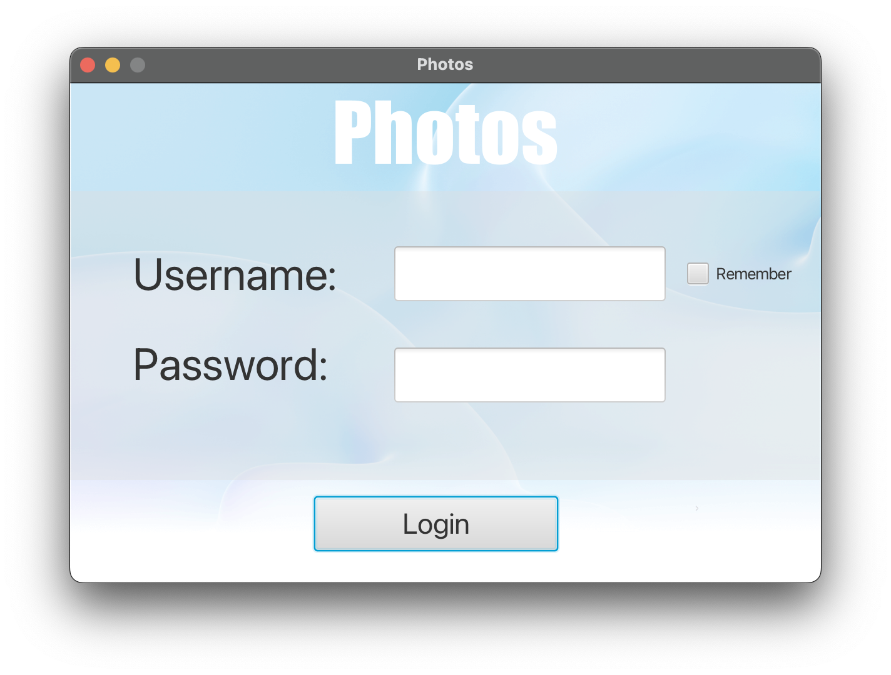
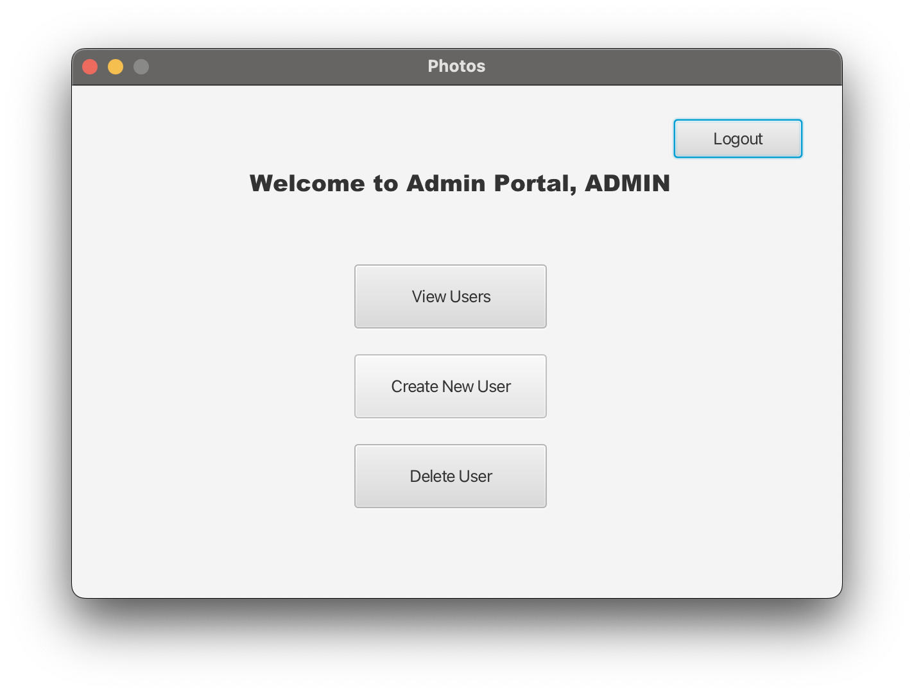
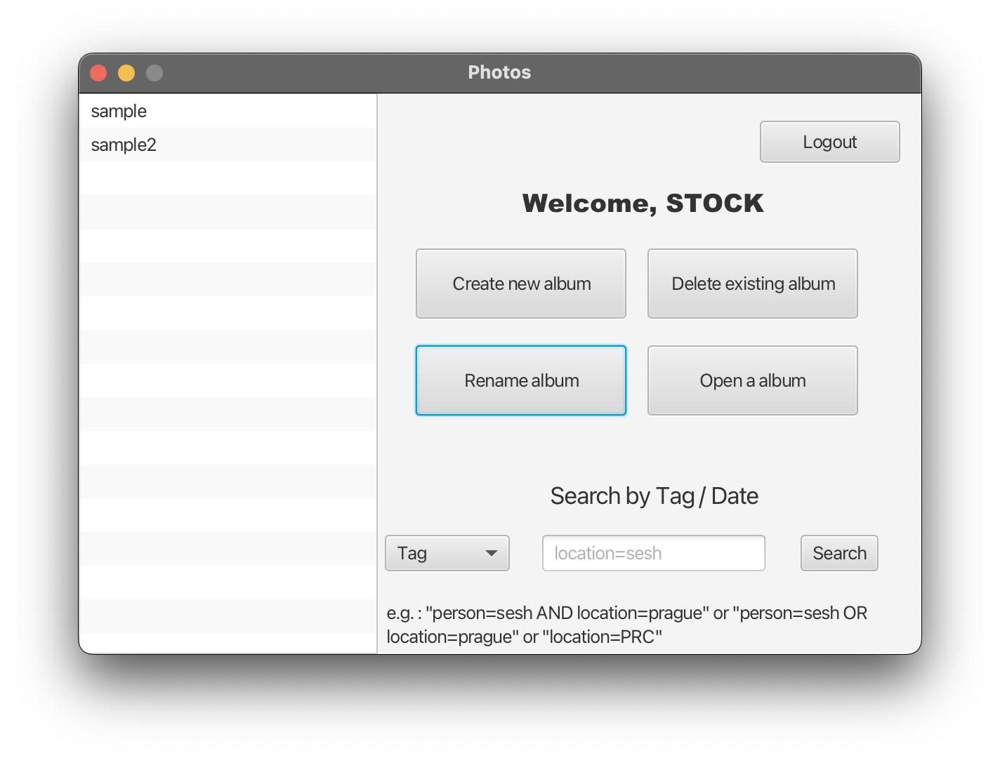
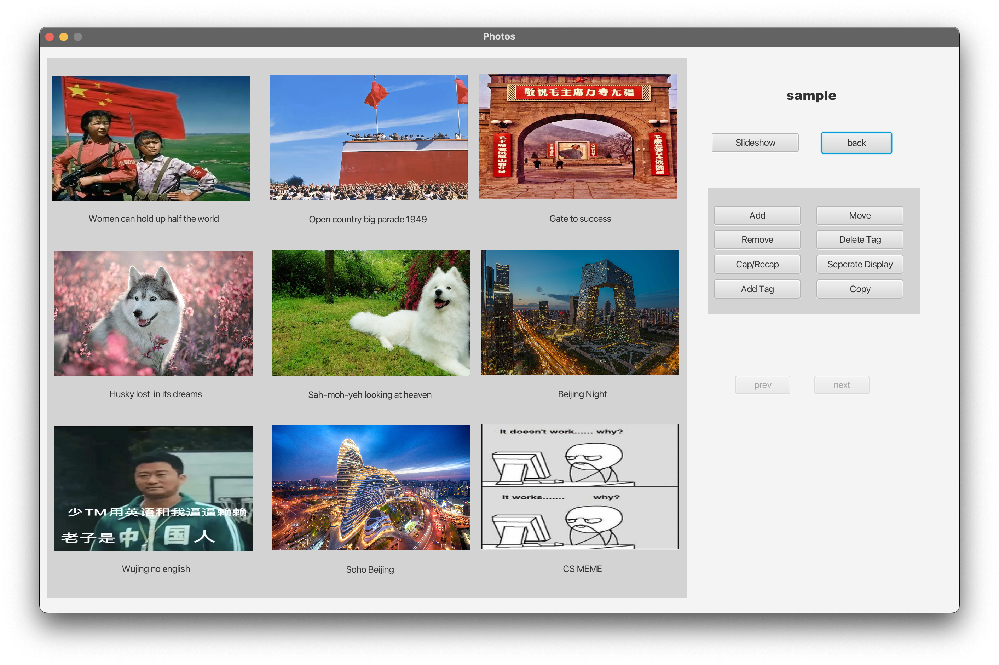
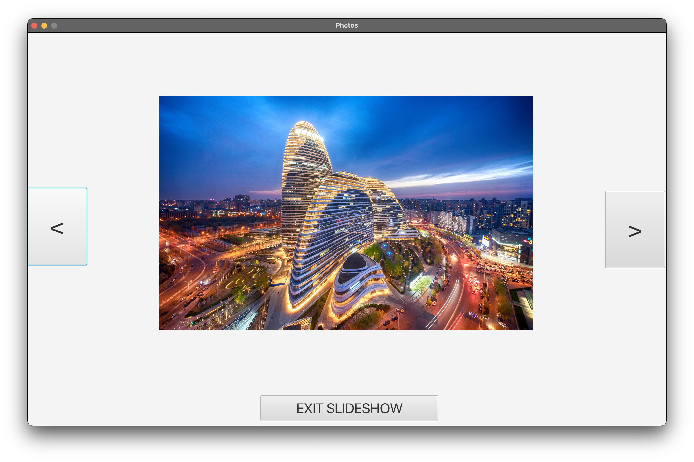

# Photos

## Description
This was the third project for CS213 Software Methodology at Rutgers University. The goal was to create a photo album application using JavaFX.

## Features
* Clean & responsive UI
* Add/edit/delete albums
* Add/edit/delete photos
* Move/copy photos to different albums
* Search photos by date
* Create new album from search results 
* Admin panel to add/edit/delete users
* Data persistence using serialization

## Local Setup
1. Clone the repository locally
2. Make sure you are using atleast Java 13
3. Make sure that JavaFX is configured properly
4. Import the "Photos" directory as a existing project. If using eclipse, there is a read me inside for instructions

## Overall Contributions 

- [Zihao Zheng (Group Lead) ](https://github.com/zhengzihao2002) - At least 88%
- Yiming Huang - 12%

For details see contri.txt

## Gallery
Due to the fact that only JavaFX is allowed, GUI may look ugly, but it has rich features.

Login Screen

Admin Panel

Home Screen

Album Details

Seperate Display

Slide Show

## For Rutgers Students
Please follow both Rutgers University's [Principles of Academic Integrity](http://academicintegrity.rutgers.edu/) and the Rutgers Department of Computer Science's [Academic Integrity Policy](https://www.cs.rutgers.edu/academics/undergraduate/academic-integrity-policy)

Only use this as an guide to see what is expected in the project. Code stealing is strictly prohibited. The author's name is hidden in the code in a form that is not visible to human eye but visible to plagiarism checkers. Don't risk it.
